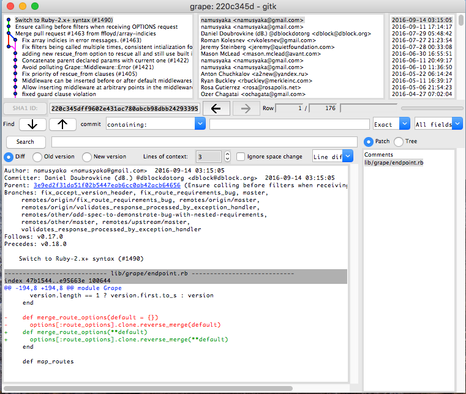

There are many tools to help debug. This post describes the process I solve a bug in [grape][grape], [#1788][#1788]. `git blame`, `git log`, `git diff`, `gitk` are commands I used in the process, and those commands help me familiar with the history of the codebase.

Steps:
1. [Confirm the bug](#confirm-the-bug)
1. [Figure out where cause the bug](#figure-out-where-cause-the-bug)
1. [Figure out the cause and fix it](#figure-out-the-cause-and-fix-it)

### Confirm the bug

The first thing should be done is to write a failing test for the bug. Write expected behavior for the bug and report the actual behavior. In the process, you can confirm it is a bug or it is just a coding mistake. The test also let others easier to reproduce and help to solve the bug.

```sh
bundle exec rspec spec/grape/api/routes_with_requirements_spec.rb

...
Failures:

  1) Grape::Endpoint get routes to namespace and path params with dots, with merged requirements
     Failure/Error: expect(last_response.status).to eq 200

       expected: 200
            got: 404

       (compared using ==)
     # ./spec/grape/api/routes_with_requirements_spec.rb:55:in `block (3 levels) in <top (required)>'
...
```

### Figure out where cause the bug

The next step is to locate where cause the bug. Use the debug tool to trace the flow of the code. `byebug` or `pry-byebug` are helpful to do this. Guess the possible location and make a break point to see whether the data in every method call is correct. The process help you familiar with the codebase.

```sh
bundle exec rspec spec/grape/api/routes_with_requirements_spec.rb:55

From: /Users/darren/Desktop/grape/lib/grape/endpoint.rb @ line 204 Grape::Endpoint#merge_route_options:

    202: def merge_route_options(**default)
    203:   binding.pry
 => 204:   options[:route_options].clone.reverse_merge(**default)
    205: end

[1] pry(#<#<Class:0x00007fad19d0f598>>)> options[:route_options].clone.reverse_merge(**default)
=> {:namespace=>"/:ns_with_dots",
 :version=>nil,
 :requirements=>{:another_id_with_dots=>/[^\/]+/}, # should be {:ns_with_dots=>/[^\/]+/, :another_id_with_dots=>/[^\/]+/}
 ...
 }
```

Through the debug tool, I found the bug is in the method `merge_route_options`. The method should return `requirements => {:ns_with_dots=>/[^\/]+/, :another_id_with_dots=>/[^\/]+/}`, but it doesn't. I found it is not reasonable to use `reverse_merge` here, since `**default` has the correct requirements and `options[:route_options].clone.reverse_merge` results in wrong requirements.

### Figure out the cause and fix it

To figure out why `reverse_merge` here, use `git blame` and find the commit makes the change.

```sh
git blame -L 202,204 lib/grape/endpoint.rb

220c345d (namusyaka   2016-09-14 04:15:05 +0900 202)     def merge_route_options(**default)
220c345d (namusyaka   2016-09-14 04:15:05 +0900 203)       options[:route_options].clone.reverse_merge(**default)
24b20d9a (Manu Campos 2014-09-28 18:48:27 +0200 204)     end
```

The last change to `reverse_merge` is in commit `220c345d` by `namusyaka`. Use `git log` and `git diff` to find the reason for the code changes.

```sh
git log 220c345d

commit 220c345dff9602e431ac780abcb98dbb24293395
Author: namusyaka <namusyaka@gmail.com>
Date:   Wed Sep 14 04:15:05 2016 +0900

    Switch to Ruby-2.x+ syntax (#1490)

git diff 220c345d\^ 220c345d lib/grape/endpoint.rb

diff --git a/lib/grape/endpoint.rb b/lib/grape/endpoint.rb
index 47b1544..e95663e 100644
--- a/lib/grape/endpoint.rb
+++ b/lib/grape/endpoint.rb
@@ -194,8 +194,8 @@ module Grape
       version.length == 1 ? version.first.to_s : version
     end

-    def merge_route_options(default = {})
-      options[:route_options].clone.reverse_merge(default)
+    def merge_route_options(**default)
+      options[:route_options].clone.reverse_merge(**default)
     end
```

There is also a built-in GUI tool `gitk` to browse the changes.

```sh
gitk 220c345d -- lib/grape/endpoint.rb
```



The last commit didn't do changes to `reverse_merge`. It was changed by another commit. Use `git log` or `gitk` to find the commit.

```sh
git log -L 166,204:lib/grape/endpoint.rb
gitk -L166,204:lib/grape/endpoint.rb
```

`-L` options means the line number of the file. The command means: find all the commits that made changes to line from 166 to 204 in file `lib/grape/endpoint.rb`.

Finally, in commit [`9f4ba67`][9f4ba67], it made the change from `merge` to `reverse_merge`. It makes no sense and there is no reason why to do the change. I try to fix it back to use `merge` and all test pass. With the test result, I have confident to conclude it as a mistake and the fix is correct. Detail can be found in [#1788][#1788].

[grape]: https://github.com/ruby-grape/grape
[#1788]: https://github.com/ruby-grape/grape/pull/1788
[9f4ba67]: https://github.com/ruby-grape/grape/commit/9f4ba67d4aca90f04a65c5ff921b1687942eb99c
