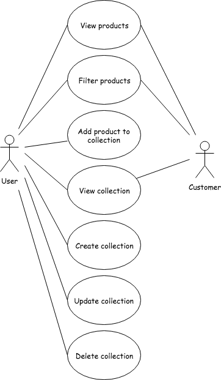

As a software engineer, my mission is to provide a technical solution to solve customer's problem. The article describes the process I used to develop the software.

## Story

`Story` is high level, abstract user requirements, which describes the context and the expected behavior of the system.

Example:

As an admin of e-commerce system, I can create a shop to sell products. I can group products to different collections, and I can set up a marketing event for each collection, such as buy one get on free.

## Use cases analysis

[Use case](https://en.wikipedia.org/wiki/Use_case) is helpful to identify stakeholders and their actions on the system. In the story, admin user and customer who buy products can be identified. Admin user can categorize product. It is helpful to identify the input and output of the system. We should clarify some ambiguous requirement or do some assumption. For example: how many products or collections are expected to be created by one user? The question would take an effect on UI design or API design. Maybe we should do pagination for products or collections.

Use cases can be written as:

### User views products

User can see all products' name, price, type, shop, vendor, created time and the collection the product belongs to. Visibility of product attributes can be toggled.

### User filters products

User can filter products by product name, type, shop, vendor. Products are paginated and default shows the first page with 10 products.

More use cases:

* User adds product to collection
* User views collections
* Customer views collections
* User creates collection
* User updates collection setting
* User deletes collection
* ...



## Database schema design

Design database schema according to the use cases.

### Use case: User views products

> User can see all products' name, price, type, shop, vendor, created time and the collection the product belongs to ...

According to the use case description, we can design the product table with the following schema:

```
# Product schema
shop_id:    integer
name:       string
price:      float
type:       string
vendor:     string
created_at: datetime
```

### Use case: User views collections

```
# Collection schema
shop_id:  integer
name:     string
start_at  datetime
end_at    datetime
```

### User case: User adds product to collection

One product can be added to multiple collections, and one collection can have multiple products. It is a `many-to-many` relation, we can use a `join table` to represent the relation.

```
# CollectionProduct schema
product_id:     integer
collection_id:  integer
```

## API endpoint design

Now we have the database schema and we can go to design our API endpoints. Again, use cases are useful in this step. We can review each use case and design API for it.

Use case | Endpoint
-------- | --------
User views products             | GET     /products
User filters products           | GET     /products?filter=filter&query=query
User adds product to collection | POST    /collection_products
User views collections          | GET     /collections
User creates collection         | POST    /collections
User updates collection setting | PATCH   /collections/:id
User deletes collection         | DELETE  /collections/:id

## Development task breakdown

We break down story to many small tasks. Each task will have an assignee and we will estimate the point of the task. The point means how hard, complex of a task. The more complex the task, the more points task would be estimated. We can schedule the development time according to tasks and their points. Also, we can give a priority to each task. We can select which tasks to do according to priority and points. Then, a development plan is generated and we can know what time the story would be completed and we can arrange QA, DevOp resources for testing and deployment.

Tasks of web application look like:

### Back-end tasks

As a back-end developer, the first thing to do is create database tables. Then we can start API tasks.

* Task 1: Create product table
* Task 2: Create collection table
* Task 3: Create collection product table
* Task 4: GET products API
* Task 5: POST collection products API
* ...

In task 1, we can mark use case `User views products` and `db design documentation` as references. That reminds the executor why and where the task come from.

Task 1, 2, 3 can be executed independently. But task 4 depends on it task 1, so we must do task 1 first. We call task 1 a `blocking` task and it should be done to prevent blocking other tasks.

### Front-end tasks

As a front-end developer, we can start from UI component with mock data, then integrate the real data from back-end API.

* Task 1: Product UI
* Task 2: Product table integration
* Task 3: Collection UI
* Task 4: Collection table integration
* ...

Task 2 integrate GET products API. So it is blocking by back-end task 4 that implements the API.
