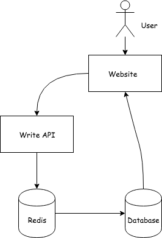
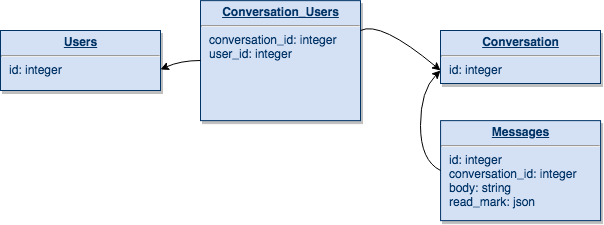

Some system designs I have did:

* [Page view system](#page-view-system)
* [Message system](#message-system)

## Page view system



When user enter website page, we call API to increment page view count. I first increment count to redis, then sync the amount to the SQL database periodically. That avoids frequently `UPDATE` in SQL database, which would block the record. Since redis has atomic `INCR` command, we won't encounter race condition.

I store diff page view count in redis instead of total count. If redis crash and the page view data loss, only part of page view would loss.

## Message system



User 1 has read message 1 at 2018/01/01 10:00:00 express as:

```
message.read_mark = { 1 => '2018-01-01 10:00:00' }
```

participants in conversation 1:

```SQL
SELECT users.*
FROM conversation_users
WHERE conversation_users.conversation_id = 1
```

messages in conversation 1:

```SQL
SELECT messages.*
FROM messages
WHERE conversation_id = 1
```

messages in conversation 1 unread by user 1

```SQL
SELECT messages.*
FROM messages
WHERE conversation_id = 1 AND (read_status -> 1) IS NULL
```
