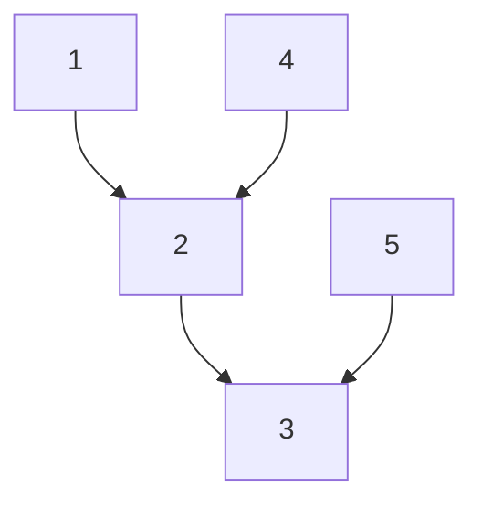

* medium, [207. Course Schedule](https://leetcode.com/problems/course-schedule/)
* hard, [2392. Build a Matrix With Conditions](https://leetcode.com/problems/build-a-matrix-with-conditions/)



1 -> 2 means you must take course 1 before take course 2.
The course has larger indegree has more dependencies.

InDegree of course 1 is 0.
InDegree of course 2 is 2.
InDegree of course 3 is 2.
InDegree of course 4 is 0.
InDegree of course 5 is 0.

Algorithm: Keep removing the node with indegree = 0. When removing a node,
update the indegree of the nodes that depend on it.

1. node 1, 4, 5 indegree = 0. Put them into the queue.
2. Remove node 1, update node 2 indegree from 2 to 1.
3. Remove node 4, update node 2 indegree from 1 to 0, add node 2 to the queue.
4. Remove node 5, update node 3 indegree from 2 to 1.
5. Remove node 2, update node 3 indegree from 1 to 0, add node 3 to the queue.
6. Remove node 3.

If there are some nodes not removed, that means we have circular dependency.

```java
public boolean canFinish(int numCourses, int[][] prerequisites) {
    List<Integer>[] graph = new List[numCourses];
    for(int i = 0; i < numCourses; i++)
        graph[i] = new ArrayList<>();
    int[] inDegree = new int[numCourses];
    for(int[] pre : prerequisites) {
        // v -> u, v is the dependency of v
        int u = pre[0], v = pre[1];
        graph[v].add(u);
        inDegree[u]++;
    }

    Queue<Integer> queue = new ArrayDeque<>();
    for(int i = 0; i < numCourses; i++) {
        if(inDegree[i] == 0)
            queue.offer(i);
    }
    while(!queue.isEmpty()) {
        int course = queue.poll();
        numCourses--;
        for(int neighbor : graph[course]) {
            inDegree[neighbor]--;
            if(inDegree[neighbor] == 0)
                queue.offer(neighbor);
        }
    }
    return numCourses == 0;
}
```
